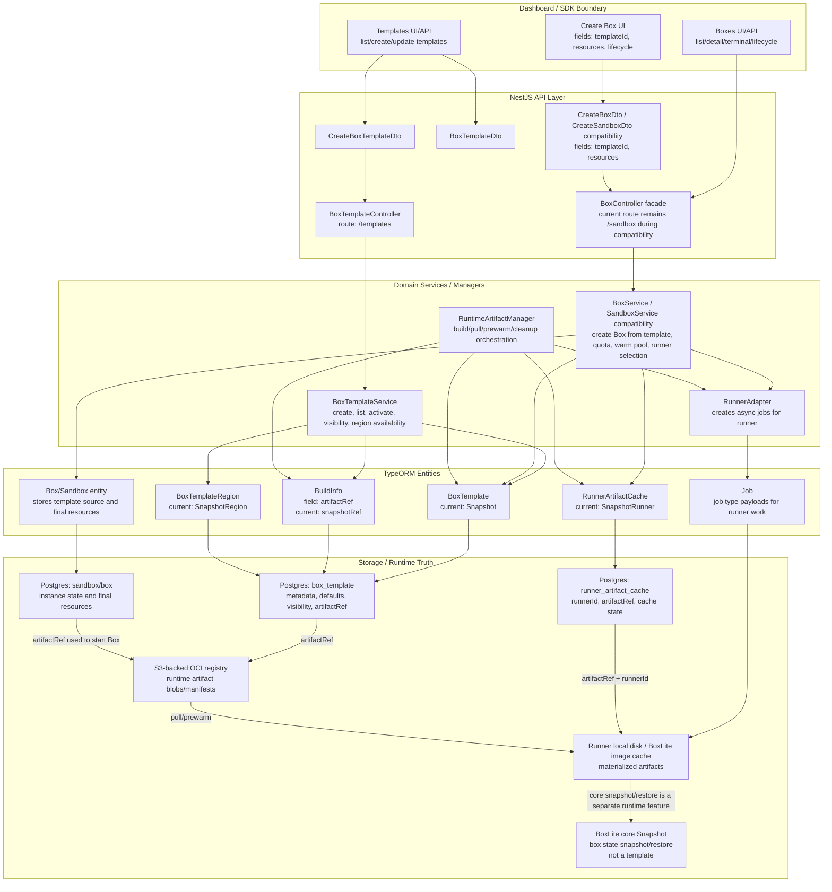

# Cloud Control Plane Architecture

This document describes the hosted BoxLite control plane. It is intentionally separate from the core runtime architecture in `docs/architecture/README.md` because the cloud product has API, database, runner, registry, and dashboard layers that do not exist in embedded BoxLite.

## Naming Model

The control plane uses four product concepts:

| Concept | Meaning | User visible | Owns binary data |
| --- | --- | --- | --- |
| `Box` | A running or stopped execution instance created for a user or organization. | Yes | No |
| `BoxTemplate` | A selectable template used when creating a Box. It stores metadata, defaults, visibility, region availability, and a pointer to a runtime artifact. | Yes, usually as `Template` | No |
| `RuntimeArtifact` / `artifactRef` | The immutable pullable material used by a Runner to start a Box. It is registry/S3 backed and can be built, pulled, copied, inspected, and removed. | No | Yes |
| `RunnerArtifactCache` | A per-runner cache/control-plane state row for a runtime artifact, including pulling/building/ready/error/removing state. | No | No |

`Snapshot` is reserved for the BoxLite core runtime feature that captures and restores Box state. The cloud control plane should not use `Snapshot` for templates or runtime artifacts after the refactor.

## Topology

## Layer Responsibilities

### L1 API Contract

The product API should expose templates, not environments or snapshots:

- `GET /templates` lists Box templates available to the organization.
- `POST /templates` creates a Box template from a base image or build info.
- `POST /boxes` or the existing compatibility route accepts `templateId` and optional resource overrides.
- Pre-launch control-plane routes should expose templates only; avoid adding `/environments` or `/snapshots` compatibility shims unless a future staged rollout explicitly needs them.

### L2 DTO And Mapping

DTOs should describe product intent:

- `CreateBoxTemplateDto` replaces `CreateSnapshotDto` in the template API.
- `BoxTemplateDto` replaces `EnvironmentDto` and `SnapshotDto` for user-facing template responses.
- Runner payload mappers should pass `artifactRef` internally, even if a runner compatibility payload still serializes the field as `snapshot` during a staged rollout.

### L3 Domain Logic

`BoxTemplateService` owns template metadata and visibility. `RuntimeArtifactManager` owns building, pulling, prewarming, and cleanup of artifacts. `BoxService` owns Box creation and resolves:

1. requested template
2. template default resources
3. user resource override
4. quota validation
5. final Box resources
6. runner and artifact cache selection

### L4 Entities And Tables

The target entity names are:

- `BoxTemplate`
- `BoxTemplateRegion`
- `RunnerArtifactCache`
- `BuildInfo.artifactRef`

Because there are no production users yet, the refactor can rename the live control-plane tables instead of keeping both names permanently. Dev data still needs an explicit migration path.

### L5 Runtime Truth

The artifact registry stores runtime artifacts. Runners pull artifacts from the registry into local cache. BoxLite core snapshots are not stored in the template table and are not managed by the template service.

## Compatibility Boundary

The refactor should be deep enough to remove the overloaded cloud `Snapshot` concept before launch, but not so deep that it rewrites unrelated historical meaning:

- Keep BoxLite core `Snapshot` APIs, tests, and docs where they mean state snapshot/restore.
- Keep historical migration files as historical records unless a current table rename migration is needed.
- Rename cloud application code that uses `Snapshot` to mean template or artifact.
- Rename S3-backed registry service names if they describe artifact storage, not core snapshots.
- Keep temporary compatibility routes only as thin aliases with deprecation comments.

## Mobile UI Constraint

All Dashboard changes that display templates, resources, or Create Box controls must be designed for mobile and desktop. Resource controls should wrap, preserve readable labels, keep inputs usable at narrow widths, and avoid relying on hover-only explanations.
