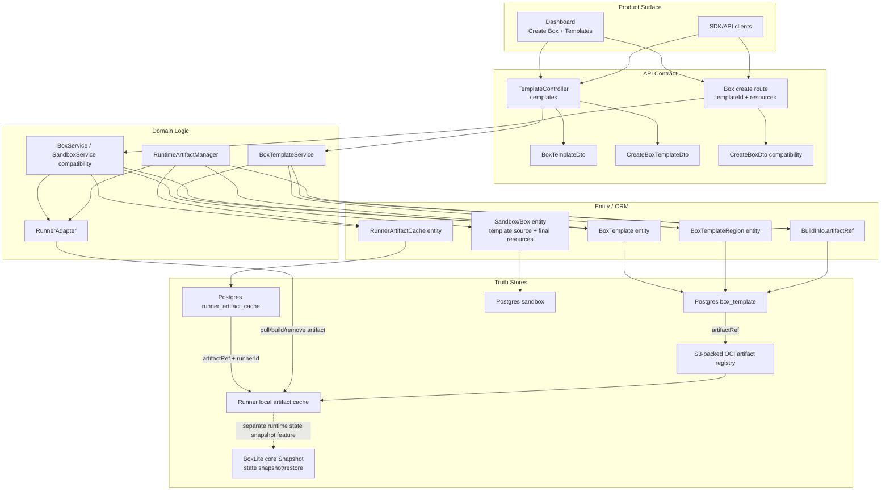

# Template And Artifact Refactor Design

## Goal

Before launch, remove the overloaded cloud `Snapshot`/`Environment` concept from the control plane. The product object used to create Boxes becomes `BoxTemplate`; the registry-backed startup material becomes `RuntimeArtifact`/`artifactRef`; runner prewarm state becomes `RunnerArtifactCache`; BoxLite core keeps its real `Snapshot` concept.

## Current Problem

The current cloud code uses `Snapshot` for product template metadata, artifact references, build information, runner prewarm/cache rows, API routes, Dashboard generated clients, and runner operations. At the same time, BoxLite core uses snapshots for actual Box state capture and restore. That makes the code hard to review and will collide with the future cloud `BoxSnapshot` product concept.

The current `Environment` layer is also only a filtered/system view over the same `Snapshot` rows. It is not a separate runtime environment.

## Naming Decision

Use `BoxTemplate` for the code/domain/API entity and `Template` in the UI. Use `RuntimeArtifact` for the immutable pullable material and `artifactRef` for the registry reference string. Use `RunnerArtifactCache` for the per-runner materialized cache row.

Rejected names:

- `Environment`: suggests env vars or deployed runtime context, not a create-time template.
- `Image`: too low-level; templates may carry defaults, visibility, regions, entrypoint, and warmup behavior.
- `RuntimeTemplate`: blurs product template and runtime artifact.
- Keeping `Snapshot` with comments only: too weak because the future Box snapshot concept will be different and the codebase is already broad enough that comments will not prevent misuse.

## Target Topology

## What Changes

### Product/API

- Add or rename the product API from `/environments` and cloud `/snapshots` to `/templates`.
- Replace `EnvironmentDto`, `SnapshotDto`, `CreateSnapshotDto`, and `PaginatedSnapshotsDto` with template DTOs at the product boundary.
- Change Create Box input to prefer `templateId` or `template` and optional `cpu`, `memory`, and `disk` overrides.
- Keep legacy route aliases only if needed for dev tooling during the rollout.

### Domain

- Rename cloud `SnapshotService` to `BoxTemplateService`.
- Rename cloud `SnapshotManager` to `RuntimeArtifactManager`.
- Make the Box create flow resolve template defaults, apply resource overrides, validate quotas, and store final Box resources.
- Keep warm pool matching tied to final resource shape, not only template id.

### Persistence

- Rename active cloud tables/entities:
  - `snapshot` -> `box_template`
  - `snapshot_region` -> `box_template_region`
  - `snapshot_runner` -> `runner_artifact_cache`
- Rename current artifact columns:
  - `BuildInfo.snapshotRef` -> `artifactRef`
  - runner cache `snapshotRef` -> `artifactRef`
- Keep historical migration files as history. Add new pre/post-deploy migrations for dev data.

### Runner And Registry

- Rename runner API DTOs and executor methods from snapshot operations to artifact operations where they handle registry images/materials.
- Rename `apps/snapshot-manager` and infra service names if practical in this pass. If the physical service path cannot be moved safely in one step, leave a short-lived compatibility folder with explicit artifact-registry naming at the infra/API boundary.
- Preserve BoxLite core snapshot/restore code and tests.

### Dashboard

- Replace environment hooks/query keys and visible copy with templates.
- Create Box shows a Template selector and an Advanced section containing Lifecycle and Resource.
- Resource overrides show the default values from the selected template and explain that empty fields use those defaults.
- Mobile must be treated as a first-class layout: controls wrap, descriptions remain readable, and inputs stay touch-friendly.

## What Does Not Change

- BoxLite core snapshot/restore modules, tests, and public APIs keep `Snapshot`.
- Low-level OS sandboxing language remains sandboxing.
- Historical migrations are not rewritten only for naming.
- Backup snapshot naming is reviewed separately because it may represent a persisted artifact for backup/restore, not a template.

## Rollout Strategy

Because there are no production users, we can do a direct pre-launch rename with a dev data migration. Still, the rollout should keep a rollback path:

1. Commit current branch checkpoint and push it.
2. Implement in an isolated branch/worktree.
3. Run local migrations against a disposable/local DB.
4. Deploy pre-deploy migration to dev.
5. Deploy API/Dashboard/Runner/registry changes to dev.
6. Run dev verification.
7. Run post-deploy cleanup only after dev verification is green.

Rollback should use the checkpoint branch plus migration down scripts. Dev data can be restored by reversing table/column renames because this refactor does not intentionally delete template/artifact data.

## Verification Matrix

| Requirement | Evidence |
| --- | --- |
| Branch safety | Clean checkpoint commit pushed before refactor branch work. |
| Architecture docs | `docs/architecture/cloud-control-plane.md`, glossary, ADR, and this design doc exist and match code changes. |
| Local API tests | Focused API tests for templates and Create Box resource overrides pass. |
| Local Dashboard tests | Create Box UI renders templates/resources on desktop and mobile. |
| Local migrations | Fresh DB and migrated DB both start successfully. |
| Runner artifact flow | Runner can pull/prewarm artifact and report cache ready. |
| Dev templates list | Dev `/templates` returns migrated templates. |
| Dev create template | Dev API can create a new template backed by an artifact. |
| Dev create Box | Dev Dashboard/API can create a Box from a template. |
| Dev resource override | CPU/memory/disk override changes final Box resources. |
| Dev terminal | Created Box terminal is usable. |

## Known Baseline Risks

The pre-refactor checkpoint pre-push hook currently does not pass in this local checkout:

- `sdk-typescript` jest exits with no tests.
- runner Go tests require `sdks/go/libboxlite.a`.
- one Rust integration test failed: `health_check_becomes_unhealthy_when_shim_killed`.

These are baseline issues from the checkpoint, not introduced by the template/artifact refactor. The implementation plan should either fix them when in scope or document them separately from refactor regressions.
